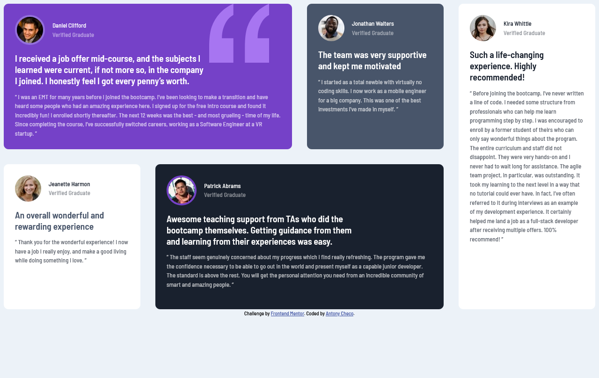

# Frontend Mentor - Testimonials grid section solution

This is a solution to
the [Testimonials grid section challenge on Frontend Mentor](https://www.frontendmentor.io/challenges/testimonials-grid-section-Nnw6J7Un7).

## Table of contents

- [Overview](#overview)
    - [The challenge](#the-challenge)
    - [Screenshot](#screenshot)
    - [Links](#links)
- [My process](#my-process)
    - [Built with](#built-with)
    - [What I learned](#what-i-learned)
- [Author](#author)

## Overview

### The challenge

Users should be able to:

- View the optimal layout for the site depending on their device's screen size

### Screenshot



### Links

- Solution URL: https://github.com/acheco/Testimonials-grid-section
- Live Site URL: https://acheco.github.io/Testimonials-grid-section/

## My process

### Built with

- Semantic HTML5 markup
- CSS custom properties
- CSS Grid
- Mobile-first workflow

### What I learned

CSS Grid is awesome to make websites with complex layouts

I like, the simples of the code is to make the challenge layout for desktop screens

```css
@media only screen and (min-width: 768px) {

  .testimonials-grid {
    grid-template-columns: repeat(4, 1fr);
    grid-template-rows: repeat(2, 1fr);
  }

  .card-1 {
    grid-column: 1 / span 2;
  }

  .card-3 {
    grid-column-start: 1;
  }

  .card-4 {
    grid-column: 2 / 4;
  }

  .card-5 {
    grid-column-start: 4;
    grid-row: 1 / span 2;
  }

}
```
## Author
- Frontend Mentor - [@acheco](https://www.frontendmentor.io/profile/acheco)

